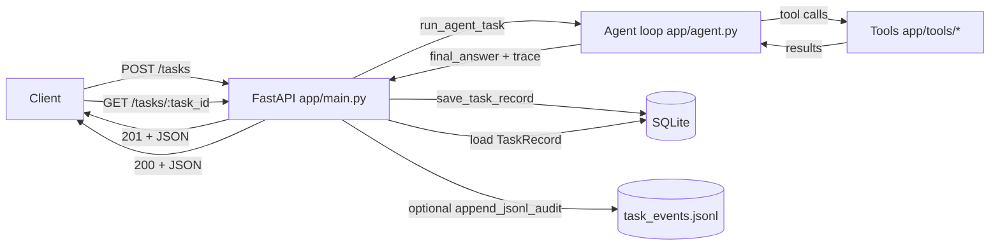

## Multi-Tool Agent REST API

A small FastAPI service that accepts a natural-language task, runs a multi-step tool-calling agent, and returns **(1) a final answer** plus **(2) a structured, fully observable trace** of reasoning steps and tool calls. Each task run is persisted to SQLite and can optionally be appended to an audit JSONL log.

---

## Architecture overview

### Components

- **API layer** (`app/main.py`)
  - `POST /tasks` (alias: `POST /task`): create + execute a task
  - `GET /tasks/{task_id}`: fetch the stored result
- **Agent loop** (`app/agent.py`)
  - Uses OpenAI Chat Completions with tool calling enabled
  - Emits a structured `trace` containing reasoning, tool calls, and usage
- **Tools** (`app/tools/*`)
  - `calculator`: safe arithmetic evaluator
  - `unit_converter`: unit conversion (Pint) + currency conversion (Frankfurter API)
  - `weather`: current weather (Open-Meteo, no API key)
  - `web_search`: DuckDuckGo web search snippets (duckduckgo-search)
- **Persistence** (`app/models.py`, `app/db.py`, `app/task_store.py`)
  - SQLite table stores: user task, status, final answer, tokens, latency, and trace JSON
  - Optional JSONL audit: append-only, one event per line

### Diagram (high-level data flow)



---

## Setup and run

### Prerequisites

- Python 3.11+
- An OpenAI API key for agent execution (`OPENAI_API_KEY`)
  - Tool-only unit tests do **not** require OpenAI.

### Install

```bash
python -m venv .venv
.venv\Scripts\activate
python -m pip install --upgrade pip
pip install -r requirements.txt
```

### Configure environment

Create or edit `.env` in the project root:

```bash
OPENAI_API_KEY=your_key_here
OPENAI_MODEL=gpt-4o-mini
DATABASE_URL=sqlite:///./data/agent.db
REQUEST_TIMEOUT_SECONDS=120.0
# Optional (defaults to data/task_events.jsonl). Set to empty string to disable JSONL auditing.
TASK_JSONL_PATH=data/task_events.jsonl
```

Notes:
- **`TASK_JSONL_PATH`** can be set to an empty string to disable JSONL auditing.
- Weather and web search tools use public endpoints and may be rate-limited by those services.

### Run the API

```bash
uvicorn app.main:app --reload
```

By default you’ll have:
- Swagger UI at `http://127.0.0.1:8000/docs`
- Create task: `POST http://127.0.0.1:8000/tasks`
- Fetch result: `GET http://127.0.0.1:8000/tasks/{task_id}`

### Run tests

```bash
pytest -q
```

To run the OpenAI integration tests (optional), ensure `OPENAI_API_KEY` is set:

```bash
pytest -q tests/test_agent_known_tasks.py
```

---

## Agent reasoning loop design

The core loop is implemented in `app/agent.py` (`run_agent_task()`).

### Inputs

- `user_message`: the natural language task
- `max_rounds`: maximum tool/reasoning iterations (default 12)

### Loop behavior (observable by design)

For each round:

- The agent calls the LLM with:
  - System prompt describing tool availability and expectations
  - Prior conversation messages, including tool results
  - Tool definitions from `app/tools/__init__.py`
- If the model returns **assistant text**, a `trace` step is appended:
  - `{"type":"reasoning", "role":"assistant", "content": "...", "round": N, "timestamp": "..."}`
- If the model returns **tool_calls**, the agent:
  - Appends the tool call message to the conversation
  - Executes each tool via `dispatch_tool_call(tool_name, arguments_json)`
  - Appends a `tool_call` trace step per tool call:
    - `{"type":"tool_call","tool_name":"...","arguments":{...},"result":"...","round":N,"timestamp":"..."}`
  - Adds the tool’s output back into the conversation (`role="tool"`) so the model can use it next round.
- If the model returns **no tool calls**, the loop ends and the agent returns:
  - `final_answer`
  - `trace` (including a final `usage` step with token totals)
  - latency and token counts

### Termination / safety

- If `max_rounds` is exceeded, the agent returns a clear error-like `final_answer` and still includes a final `usage` trace step.
- Tool failures are wrapped as `"Error: ..."` strings so the agent can continue and explain what happened.

---

## Example tasks (expected outputs + traces)

All examples below show the **shape** of outputs returned by `POST /tasks`.

Important:
- `task_id`, `created_at`, `latency_ms`, `timestamp`, and token counts will vary.
- `web_search` and `weather` results can vary because they depend on live services.
- The trace is a list of dictionaries, with step types such as: `reasoning`, `tool_call`, `usage`.

### Example 1: Calculator (deterministic)

**Request**

```json
{ "task": "What is (2+3)*4? Reply with the numeric result." }
```

**Expected response (representative)**

```json
{
  "task_id": "…",
  "status": "completed",
  "user_message": "What is (2+3)*4? Reply with the numeric result.",
  "final_answer": "20",
  "trace": [
    { "type": "reasoning", "content": "I'll compute it using the calculator tool.", "round": 0, "timestamp": "…" },
    {
      "type": "tool_call",
      "tool_name": "calculator",
      "arguments": { "expression": "(2+3)*4" },
      "result": "20",
      "round": 0,
      "timestamp": "…"
    },
    { "type": "reasoning", "content": "20", "round": 1, "timestamp": "…" },
    { "type": "usage", "prompt_tokens": 123, "completion_tokens": 45, "total_tokens": 168, "timestamp": "…" }
  ],
  "latency_ms": 12.3,
  "prompt_tokens": 123,
  "completion_tokens": 45,
  "total_tokens": 168,
  "error": null
}
```

### Example 2: Unit conversion (deterministic)

**Request**

```json
{ "task": "Use the unit_converter tool: convert 1 km to meters. Then state the answer in plain text." }
```

**Expected trace highlight**

- A `tool_call` step:
  - `tool_name`: `"unit_converter"`
  - `arguments`: `{ "value": 1, "from_unit": "km", "to_unit": "m" }`
  - `result` containing: `"1.0 km = 1000 m"` (or equivalent)

### Example 3: Multi-tool workflow (mostly deterministic)

**Request**

```json
{
  "task": "First use the calculator to compute 2**10. Then use unit_converter to convert that many meters to kilometers. Summarize both results."
}
```

**Expected trace highlight**

- A `tool_call` for calculator returning `"1024"`
- A `tool_call` for unit conversion returning something like `"1024.0 m = 1.024 km"`
- `final_answer` summarizing both

### Example 4: Weather (live; output varies)

**Request**

```json
{ "task": "What's the current weather in Tokyo? Use the weather tool." }
```

**Expected trace highlight**

- A `tool_call` step:
  - `tool_name`: `"weather"`
  - `arguments`: `{ "city": "Tokyo" }`
  - `result` string containing a location and current conditions, e.g.:
    - `"Location: Tokyo, … Temperature: … Relative humidity: … Wind speed: … Conditions: …"`

### Example 5: Web search (live; output varies)

**Request**

```json
{ "task": "Use web_search: summarize the top 3 results for 'FastAPI dependency injection'." }
```

**Expected trace highlight**

- A `tool_call` step:
  - `tool_name`: `"web_search"`
  - `arguments`: `{ "query": "FastAPI dependency injection", "max_results": 3 }`
  - `result` is a multi-paragraph string with numbered results and URLs/snippets

### Example 6: Failure case (no OpenAI key)

If `OPENAI_API_KEY` is missing, creating a task will still return a persisted record:

**Request**

```json
{ "task": "Say hello." }
```

**Expected response (representative)**

```json
{
  "task_id": "…",
  "status": "failed",
  "user_message": "Say hello.",
  "final_answer": null,
  "trace": [],
  "latency_ms": null,
  "prompt_tokens": null,
  "completion_tokens": null,
  "total_tokens": null,
  "error": "OPENAI_API_KEY is not set and no client was provided"
}
```

---

## Observability and logging

- **Structured trace**: returned in every API response and stored in SQLite (`trace_json`).
- **Queryability**: use `GET /tasks/{task_id}` to retrieve a stored run.
- **Persistent audit log (JSONL)**: if `TASK_JSONL_PATH` is set, every run appends one JSON object per line including full trace.

